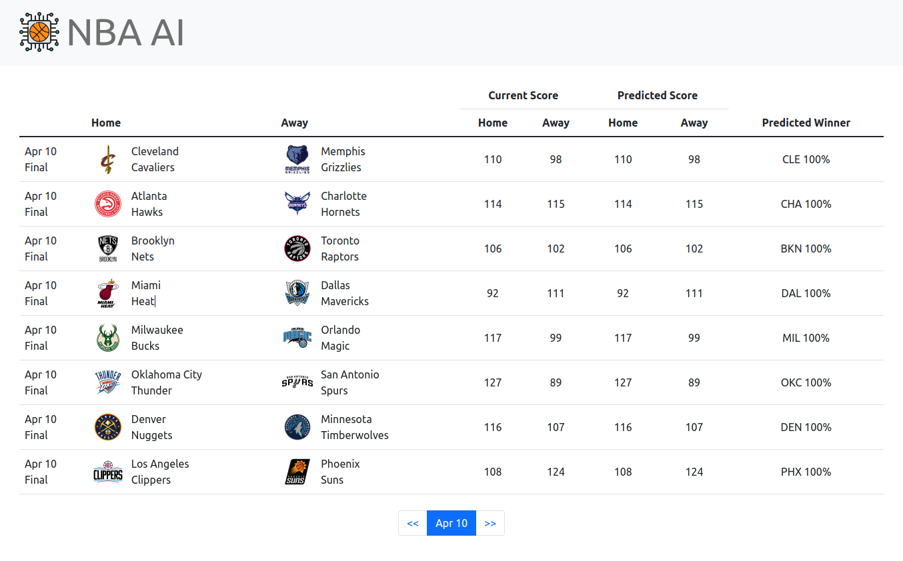
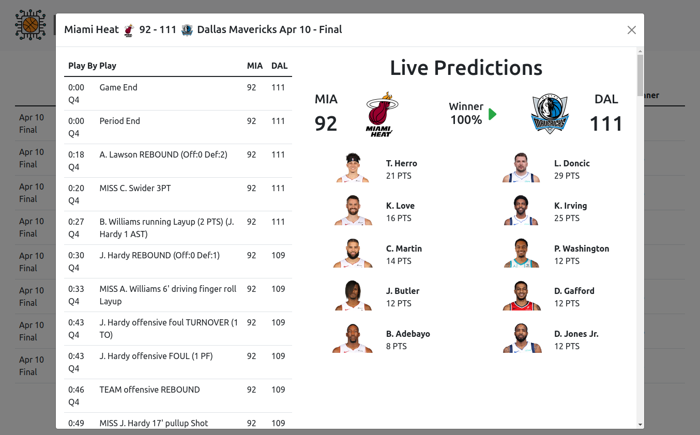
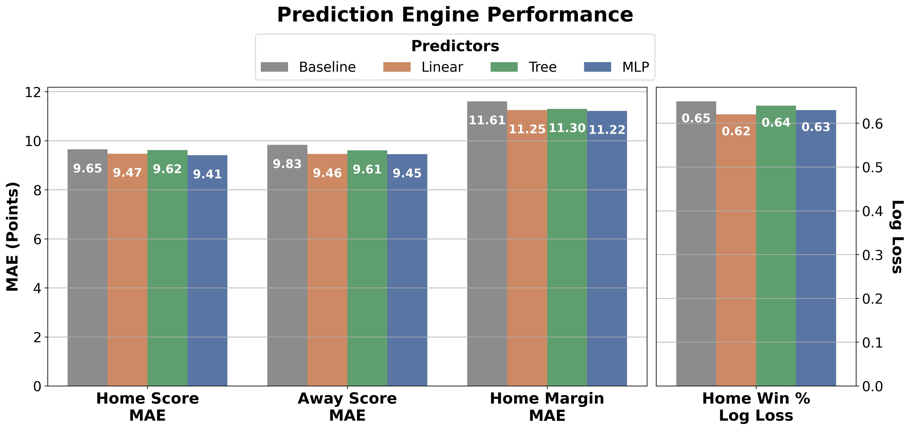

# NBA AI

Using AI to predict the outcomes of NBA games.

## Table of Contents
* [Project Overview](#project-overview)
    * [Current State](#current-state)
    * [Future Goals](#future-goals)
    * [Guiding Principles](#guiding-principles)
* [Web App](#web-app)
* [Prediction Engines](#prediction-engines)
* [Installation and Usage](#installation-and-usage)

## Project Overview

This project aims to streamline the process of predicting NBA game outcomes by focusing on advanced AI prediction models rather than extensive data collection and management. Unlike my previous project, [NBA Betting](https://github.com/NBA-Betting/NBA_Betting/tree/main), which aimed to create a comprehensive feature set for predicting NBA games through extensive data collection, this project simplifies the process. While the previous approach benefited from various industry-derived metrics, the cost and complexity of managing the data collection were too high. This project focuses on a core data set, such as play-by-play data, and leverages deep learning and GenAI to predict game outcomes.

### Current State

The project is currently in the early stages of development, with a basic prediction engine that uses simple models like ridge regression, XGBoost, and a basic MLP. The prediction engine is limited to basic game score predictions and win percentages. The web app provides a simple interface for displaying games for the selected date along with current scores and predictions. Fortunately, this is as complicated as the project should become. The goal is to gradually integrate most pieces of the Database Updater and part of the Games API logic into a single prediction engine. This will allow for a more streamlined process and a more capable prediction engine.


The project is built around a few key components:
* **Database Updater**: This component is responsible for updating the database with the latest NBA game data. It fetches data from the NBA Stats API, performs ETL operations, generates features, creates predictions, and stores the data in a SQLite database. It consists of a few modules:
    * `database_update_manager.py`: The main module that orchestrates the entire process.
    * `schedule.py`: Fetches the schedule from the NBA API and updates the database.
    * `pbp.py`: Fetches play-by-play data for games and updates the database.
    * `game_states.py`: Parses play-by-play data to generate game states and updates the database.
    * `prior_states.py`: Determines prior final game states for teams.
    * `features.py`: Uses prior final game states to generate features for the prediction engine.
    * `predictions.py`: Generates predictions for games using the chosen prediction engine.

* **Games API**: This component is responsible for updating predictions for ongoing or completed games and providing the data to the web app. It fetches data from the database, generates predictions, and serves the data to the web app.
    * `games.py`: Fetches game data from the database, manages prediction updating and data formatting.
    * `api.py`: Defines the API endpoints.
    * `games_api.md`: API documentation.

* **Web App**: This component is the front end of the project, providing a simple interface for users to view games and predictions. It is built using Flask.
    * `start_app.py`: The main entry point for the web app found in the root directory.
    * `app.py`: The main module that defines the Flask app and routes.
    * `game_data_processor.py`: Formats game data from the API for the web app.
    * `templates/`: Contains the HTML templates for the web app.
    * `static/`: Contains the CSS and JavaScript files for the web app.

### Future Goals


1. **Data Sourcing**: Focus on a minimal number of data sources that fundamentally describe basketball. Currently, we use play-by-play data from the NBA API. In the future, incorporating video and tracking data would be interesting, though these require considerably more resources and access.

2. **Prediction Engine**: This is the core of the project and will be the development focus until the 2024-2025 season begins. The current prediction engine options will be replaced with a DL and GenAI-based engine, allowing for decreased data parsing and feature engineering while also scaling to predict more complex outcomes, including individual player performance.

3. **Data Storage**: Future data storage will more seamlessly integrate with the prediction engine. The storage requirements will combine the current SQL-based data used for the API and web app with more advanced vector-based storage for RAG-based GenAI models.

4. **Web App**: This is the project's front end, displaying the games for the selected date along with current scores and predictions. The interface will remain simple while usability is gradually improved. A separate GenAI chat will be added in the future to allow users to interact with the prediction engine and modify individual predictions based on their preferences.

### Guiding Principles


- **Time Series Data Inclusive:** A focus on incorporating the sequential nature of events in games and across seasons, recognizing the significance of order and timing in the NBA.
- **Minimal Data Collection:** Streamlining data sourcing to the essentials, aiming for maximum impact with minimal data, thereby reducing time and resource investment.
- **Wider Applicability:** Extending the scope to cover more comprehensive outcomes, moving beyond standard predictions like point spreads or over/unders.
- **Advanced Modeling System:** Developing a system that is not only a learning tool but also potentially novel compared to the methods used by odds setters.
- **Minimal Human Decisions:** Reducing the reliance on human decision-making to minimize errors and the limitations of individual expertise.

## Web App




## Prediction Engines

Currently, there are a few basic prediction engines used to predict the outcomes of NBA games. These serve as placeholders for the more advanced DL and GenAI engines that will be implemented in the future. The current engines make pre-game predictions for home and away scores using ML models. These predictions are then used to calculate the win percentage and margin for the home team. Updated (after game start) predictions are based on a combination of the current game score, time remaining, and the pre-game predictions.

### Current Prediction Engines

- **Linear**: Based on a Ridge Regression model, using features generated by aggregating prior final game states for the teams involved.
- **Tree**: Based on an XGBoost model, using the same features as the Linear model.
- **MLP**: Based on a PyTorch MLP model, using the same features as the Linear model.
- **Random**: A random predictor that generates random scores for each game.
- **Baseline**: A simple predictor that predicts the home and away scores based on the home and away teams' PPG and their opponents' PPG. The formula for the baseline predictor is:
  - Home Score: (Home PPG + Away Opponent PPG) / 2
  - Away Score: (Away PPG + Home Opponent PPG) / 2
  - Home Margin: Home Score - Away Score
  - Home Win Probability: Sigmoid(-0.2504 + 0.1949 * Home Margin)


### Performance Metrics

The current metrics are based on pre-game predictions for the home and away team scores, along with downstream metrics such as win percentage and margin. These simple predictors currently outperform the baseline predictor.

In the future, a more challenging baseline based on the Vegas spread will be added when the DL and GenAI models are implemented.



## Installation and Usage

### Step 1: Clone the Repository

Clone the repository to your local machine using the following command:

```sh
git clone https://github.com/NBA-Betting/NBA_AI.git
```

### Step 2: Set Up a Virtual Environment (Optional but Recommended)

Navigate to the project directory:

```sh
cd NBA_AI
```

Create a virtual environment:

```sh
python -m venv venv
```

Activate the virtual environment:

```sh
source venv/bin/activate
```

### Step 3: Install Dependencies

Install the required dependencies:

```sh
pip install -r requirements.txt
```

### Step 4: Set Up Environment Variables

Rename the `.env.template` file to `.env`:

```sh
cp .env.template .env
```

Open the `.env` file in your preferred text editor and set the necessary values:

```
# .env
# Flask secret key (Optional, Flask will generate one if not set)
# WEB_APP_SECRET_KEY=your_generated_secret_key

# Project root path (Mandatory)
PROJECT_ROOT=/path/to/your/project/root
```

Replace `/path/to/your/project/root` with the actual path to the root directory of your project on your local machine. You can leave `WEB_APP_SECRET_KEY` commented out if you want Flask to generate it automatically.

### Step 5: Configure the Database

By default, the configuration will point to the empty database (`data/NBA_AI_BASE.sqlite`). If you want to use the pre-populated 2023-2024 season data:

1. Download the SQLite database zip file from the GitHub release page:

   - Go to the [Releases page](https://github.com/NBA-Betting/NBA_AI/releases) of the repository.
   - Find the latest release (e.g., `v0.1`).
   - Download the `NBA_AI_2023_2024.zip` file attached to the release.

2. Extract the zip file:

   ```sh
   unzip path/to/NBA_AI_2023_2024.zip -d data
   ```

3. Update the `config.yaml` file to point to the extracted database:

   ```yaml
   database:
     path: "data/NBA_AI_2023_2024.sqlite"  # <<< Set this to point to the database you want to use.
   ```

### Step 6: Run the Application

Run the application using the `start_app.py` file in the root directory:

```sh
python start_app.py
```

### Accessing the Application

Once the application is running, you can access it by opening your web browser and navigating to:

```
http://127.0.0.1:5000/
```

### Usage Notes

- The database updater will attempt to update all games for the requested season, regardless of which database is being used. This may result in a large number of external requests to the NBA Stats API endpoints and a lengthy ETL process.
- Each season update will take a few minutes, depending on your computer's resources and connection speed. This is a one-time load for each season.
- To limit this, the API is currently restricted to the 2023-2024 and 2024-2025 seasons. More seasons can be added if desired. The update process should work back to the 2000-2001 season.

```yaml
api:
  max_game_ids: 20
  valid_seasons:
  - "2023-2024"
  - "2024-2025"
```

- These restrictions are bypassed if the code is run directly (instead of via the web app or Games API).
- Please see the Prediction Engine section for further notes about setting up predictors.
